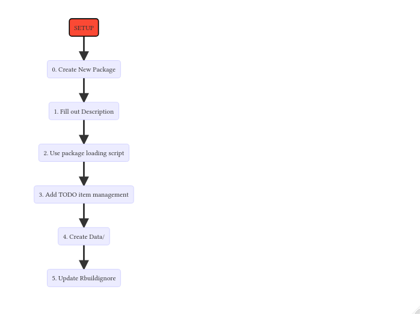
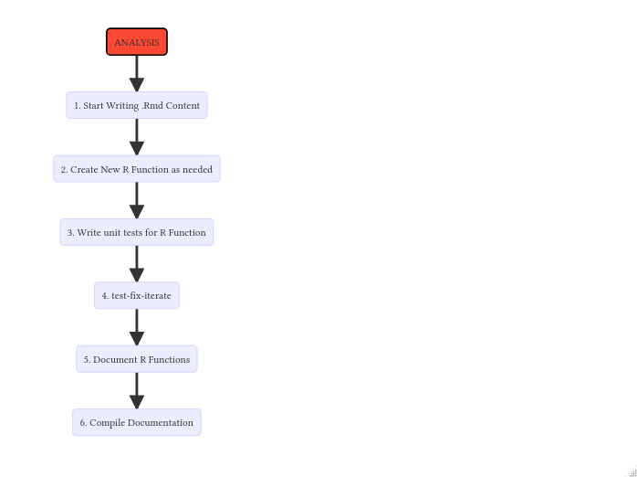
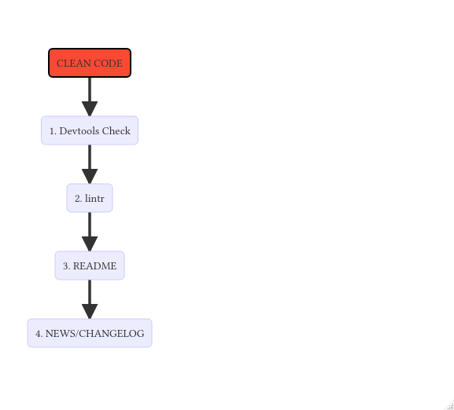

# Table Of Contents

* [Setup](#setup)
  - [Step 1 - New Package](#Create-a-new-package-file)
  - [Step 2 - DESCRIPTION](#Fill-out-description-file)
  - [Step 3 - Package Loading](#use-the-package-loading-script)
  - [Step 4 - TODO Management](#todo-management)
  - [Step 5 - Data/](#create-data-directory)
  - [Step 6 - .Rbuildignore](#Update-Rbuildignore)
  - [Step 7 - Ethics](#ethics)
* [Analysis](#analysis)
  - [Step 1 - Writing .Rmd](#Begin-Writing-Your-Content)
  - [Step 2 - Visualization](#visualization)
  - [Step 3 - New Functions](#Create-New-R-Function-as-needed)
  - [Step 4 - Unit Tests](#write-unit-tests)
  - [Step 5 - Iteration](#test-fix-iterate)
  - [Step 6 - Documentation](#Document-Completed-R-Functions)
  - [Step 7 - Documentation Compilation](#Compile-Your-Documentation)
* [Modeling](#modeling)
* [References](#references)
* [Reproducability](#reproducability)
* [Fine Tuning](#fine-tuning)
* [Clean Code](#clean-code)
  - [Step 1 - Devtools Check](#devtools-check)
  - [Step 2 - Lintr](#lintr)
  - [Step 3 - README](#a-readme)
  - [Step 4 - CHANGELOG](#changelog)
* [Tips](#tips)

# SETUP

[Return To Table Of Contents](#table-of-contents)

<center>



</center>

## Create a new package file

[Return To Table Of Contents](#table-of-contents)

> file --> New Project --> New/Existing Directory --> R Package

## Fill out description file

[Return To Table Of Contents](#table-of-contents)

```yaml
Package: workflow
Title: A Robust workflow for software driven data analysis
Version: 0.0.1
Authors@R:
    person(given = "Bryan",
           family = "Jenks",
           role = c("aut", "cre"),
           email = "bryanjenks@protonmail.com",
           comment = c(ORCID = "0000-0002-9604-3069"))
Description: A Robust document for discussing a great way to structure analysis.
License: MIT file LICENSE # The license can be written out in the 'LICENSE' File
Encoding: UTF-8
LazyData: true
# Roxygen: list(markdown = TRUE) if you want markdown support for the documentation use this option
```


## use the package loading script

[Return To Table Of Contents](#table-of-contents)

This way it just loops over a vector of the packages and installs what isnt alread installed and loads what is installed so it is available for the RMarkdown product.

```r
# Package names
packages <- c("tidyverse",################################### Tidyverse packages
	      "here",######################################## Directory management
	      "knitr", "rmarkdown",########################## RMD libs
	      "todor", "lintr",	############################# Code management libs
	      "DT", "kableExtra",############################ Table libs
	      "roxygen2", "testthat", "usethis", "devtools" # package libs
	     )

# Install packages not yet installed
installed_packages <- packages %in% rownames(installed.packages())
if (any(installed_packages == FALSE)) {
  install.packages(packages[!installed_packages])
}

# Packages loading
lapply(packages, library, character.only = TRUE) %>%
  invisible()
```

If performing a reporoducable analysis utilize `packrat` for a snapshot of your utilized packages / libraries.

```r
# setup packrat snapshot in your new package/project
packrat::init(here::here())
# To add package for use to your project in this snapshot environment you install as normal:
install.packages("runes")
# when you're ready to save your snapshot to packrat for your reproducable project:
packrat::snapshot()
# to check the status of your snapshot
packrat::status()
# to remove a package from your snapshot
remove.packages("runes")
# and to restore one
packrat::restore()
# if packages are not used:
# Use packrat::clean() to remove them. Or, if they are actually needed
# by your project, add `library(packagename)` calls to a .R file
# somewhere in your project.
```

There are also plenty of GUI options for working with `packrat` in RStudio

## TODO management

[Return To Table Of Contents](#table-of-contents)

If you have multiple files or a large RMarkdown document and you use commented `<!-- TODO/BUG/FIXME/HACK -->` items and want to see where all of them are then use the `todor` package with the following snippet

```r
# Create a vector of document paths in the current directory (use with HERE() package)
# This is great for multiple R markdown documents
docs <- dir(pattern = "*.Rmd") %>%
    as.vector()
todor::todor(file = docs)

# A less hacky way of checking a whole PACKAGE for TODO's is just the built in function:
todor::todor_package()
```

## Create Data directory

[Return To Table Of Contents](#table-of-contents)

Create the `Data/` directory to hold raw data files that will be cleaned and processed by `R` scripts in the `R/` directory for the RMarkdown document when sourced.

To save tibbles or data from `R` that has already been tidy-ified to make sure they dont lose their specifications i.e. that a <chr> column is a factor, etc etc use the _{feather}_ package.

```r
library(feather)
feather::write_feather(<x>,<path>)
feather::read_feather(<path>)
```

## Update Rbuildignore

[Return To Table Of Contents](#table-of-contents)

When building a package for installation and reproducablilty have the build process ignore certain files, driectories and other things that it shouldn't touch during the build process

**OPTIONAL**

if keeping the package in `GIT` version control then also update the `.gitignore`


## Ethics

[Return To Table Of Contents](#table-of-contents)

"`deon` is a command line tool that allows you to easily add an ethics checklist to your data science projects. The conversation about ethics in data science, machine learning, and AI is increasingly important. The goal of `deon` is to push that conversation forward and provide concrete, actionable reminders to the developers that have influence over how data science gets done."

[deon](https://github.com/drivendataorg/deon)

[](http://deon.drivendata.org/)

# ANALYSIS

[Return To Table Of Contents](#table-of-contents)

<center>



</center>

## Begin Writing Your Content

[Return To Table Of Contents](#table-of-contents)

In your RMarkdown Document you can begin filling in your content with what ever template or way you prefer to write in your document. There are many ways to convey the results and workflow of your analysis, you have a package, a single stand alone RMarkdown document, a bookdown book, HTML output only, theres a million ways to perofrm an analysis and this is just going to be a document about some of the more common parts of the workflow with nuances left to personalization and preference.

Never use `require()` or `library()` in a packaged analysis, put these items in the DESCRIPTION file as imports or suggests to import them

For local file management in the `.Rproj` project directory, i and many many others prefer to use the `here` package that uses the project root directory as the relative root and use relative directory references to reference other files in your package.

## Visualization

[Return To Table Of Contents](#table-of-contents)

Two very great addins in RStudio for graphically editing and creating initial plots and visualizations without having to type all the code from scratch:

- `esquisse` --- Initial plot creation to minimize boiler plate writing
- `ggedit` --- Editing created plots graphically
- `colourpicker` --- Custom color code pickers for themes and general use

## Create New R Function as needed

[Return To Table Of Contents](#table-of-contents)

functions into seperate `R` script files in `R/` and if there are a lot of functions group their filenames with some sort of convention that groups them `AAA_Function.R`

## Write Unit Tests

[Return To Table Of Contents](#table-of-contents)

To start using unit tests `devtools::use_testthat()`

to run all current tests `Ctrl + Shift + T` or `devtools::test()`

## Test Fix Iterate

[Return To Table Of Contents](#table-of-contents)

Run your tests on your developing functions and fix any **ERRORS**, **WARNINGS**, or **NOTES** that come up

## Document Completed R Functions

[Return To Table Of Contents](#table-of-contents)

Use `roxygen2` documentation on all functions script files in `R/`

- **First line:** Title
- **Second line:** Description
- **Subsequent lines:** Details

[A link to Cheat Sheet Documentation](https://roxygen2.r-lib.org/articles/rd-formatting.html#introduction)

Bare Bones Template:

```r
#' @title	# This Is the Name of your funtion
#' @description # This is a good explanation of your function
#' @detail	# This is each granular detail of your function (there can be multiple of these sections)
#' @param	# This is a parameter of your function
#' @return	# This is what your function returns
#' @export	# This is how your function gets exported to the NAMESPACE and is available for use after library() otherwise you use :::
```

[Documentation Info](http://r-pkgs.had.co.nz/man.html)

## Compile Your Documentation

[Return To Table Of Contents](#table-of-contents)

Run `devtools::document()` (or press `Ctrl + Shift + D` in RStudio) to compile your documents into function documentation that appears in the `man/` directory and the NAMESPACE that contains all `@export` functions.

# MODELING

beyond just the `lm()` function, you can make a model object by `model <- lm(var1 ~ var2 + var4, data)` and then wrap that model object with

```r
performance::check_model(model)
```

and the output is graphical and awesomely useful. it is a bit slow though

<!-- TODO This section needs to be fleshed out more with more info on modeling -->

# REFERENCES

[Return To Table Of Contents](#table-of-contents)

Writing a bibliography for your R packages

```r
# automatically create a bib database for R packages
knitr::write_bib(c(
  .packages(), packages #this is made in the lib loading section
), 'packages.bib')
```

in your `yaml` portion of the RMarkdown document you can use a `yaml` array to contain multiple `.bib` files to have one solely for your R Packages that are generated from the code chunk above and also any other cited sources you wish to compile manually or otherwise. like so:

```yaml
bibliography: [cited.bib, packages.bib]
```

and for packages, you can use this `yaml` trick to have all non-inline citations i.e. the `R` packages used, immediately cited at the end of the document:

```yaml
nocite: '@*'
```

you can also use the {`citr`} package to use an RStudio addin for citations

# REPRODUCABILITY

[Return To Table Of Contents](#table-of-contents)

One of the most important parts of science and academia is the ability for research or conclusions to be reproduced. People shouldn't be wondering what software you were using, or what versions of them you were running, and one way of capturing this information would be to capture your session info in a text document.

```r
writeLines(capture.output(sessionInfo()),
	"sessionInfo.txt")
```

# FINE TUNING

[Return To Table Of Contents](#table-of-contents)

with the `profvis` package you can select a chunk of code and in RStudio click the profile option and profile the selected code and show resource intensive code and tune them to be more efficient. Good background on this from [HERE](https://resources.rstudio.com/rstudio-conf-2017/understand-code-performance-with-the-profiler-winston-chang)
Another tool to test variations of a function to see which is the most maximally efficient is the `microbenchmark` package.

```r
# this defaults to 100 iterations of each passed function call and will benchmark them
# and tells you which of the different variations are maximally efficient.
microbenchmark::microbenchmark(func1, ...)
```

# CLEAN CODE

[Return To Table Of Contents](#table-of-contents)

<center>



</center>

## Devtools Check

[Return To Table Of Contents](#table-of-contents)

To check if your pacakge is ready for distribution and installable use:

`devtools::check()`, or press `Ctrl + Shift + E` in RStudio. to check your package for ERRORS, WARNINGS, or NOTES

## Lintr

[Return To Table Of Contents](#table-of-contents)

use `lintr` for linting your R code

```r
# Good suggestions for making legible and consistently formatted code
lintr::lint_package()
```

## A README

[Return To Table Of Contents](#table-of-contents)

Use `README.md` file for github or just general user info, even keep an `.Rmd` document that compiles to a markdown document if you so wish that can be used to explain the package to users in a medium --> long form format so the user knows what to do to reproduce the analysis or use the package.

## CHANGELOG

[Return To Table Of Contents](#table-of-contents)

Use `NEWS.md` as the CHANGELOG for your package

i start all changelogs with semantic versioning from the 'Keep a change log project' a snippet of that changelog might look like this:

```markdown
# Changelog

All notable changes to this project will be documented in this file.

The format is based on [Keep a Changelog](https://keepachangelog.com/en/1.0.0/),
and this project adheres to [Semantic Versioning](https://semver.org/spec/v2.0.0.html).

## Summary

> Given a version number MAJOR.MINOR.PATCH, increment the:
>
> 1. MAJOR version when you make incompatible API changes,
> 2. MINOR version when you add functionality in a backwards compatible manner, and
> 3. PATCH version when you make backwards compatible bug fixes.
>
> Additional labels for pre-release and build metadata are available as extensions to the MAJOR.MINOR.PATCH format.

### Guiding Principles

> Changelogs are for _humans_, not machines.
> There should be an entry for every single version.
> The same types of changes should be grouped.
> Versions and sections should be linkable.
> The latest version comes first.
> The release date of each version is displayed.
> Mention whether you follow [Semantic Versioning](https://semver.org/spec/v2.0.0.html).

### Types of changes

> Added for new features.
> Changed for changes in existing functionality.
> Deprecated for soon-to-be removed features.
> Removed for now removed features.
> Fixed for any bug fixes.
> Security in case of vulnerabilities.

## [Unreleased]

### Added

-

### Changed

-

### Deprecated

-

### Removed

-

### Fixed

-

### Security

-

## [0.0.1] - 2020-01-22

### Added

- Core functionality of a-z alphabet translation to Elder Futhark
- all special characters, numeric, or otherwise all ignored as pass through
- New function `runes_table()` create a 3 column data frame with the unicode sequence, transcription, and character of the entire Elder Futhark alphabet to be used for inputting into documents, reference, or any other purpose

### Changed

- new parameter to `runes()` `hide=FALSE` is now the default option but when set to true, the English 'x' & 'q' characters will not pass through the function and appear at all since there is no equivalent rune.
    + added unit tests to support this new parameter option

### Deprecated

-

### Removed

-

### Fixed

-

### Security

-


```

# TIPS

[Return To Table Of Contents](#table-of-contents)

- Using `# TEXT -----` inside an R code chunk adds it to the table of contents of the RMarkdown document
- Good websites for [RDocumentation](https://www.rdocumentation.org/) and Searching for [R Resources](https://rseek.org/)
- Date opertor with lubridate `%m+%` and `%m-%` to add a date part to a date that is wise to things like jan31st doesnt go to feb31st but to feb28/29th
- if moving data between languages use feather package and `.feather` files to make the interchange


to be expounded on later:

Template package, project, document templates for my analyses

- reference: https://github.com/ledbettc/CIDAtools
- reference: https://github.com/atlas-aai/ratlas
